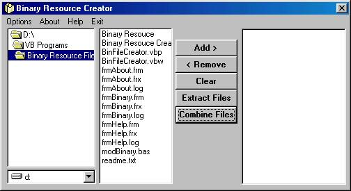



## Binary Resource Creator v1\.2 \*\*UPDATED\*\*

### Description

Use this nifty program to combine files into a single binary file. Allows you to Combine and Extract files using a simple, easy to use, interface. Great for protecting your files when you distribute your apps/games. Also keeps your files seperate from you EXE so to update your app/game's graphics or sounds etc all you need to do is redistribute the binary file. If you like it a vote would be nice. If you hate it please tell me why. =]

Vist my website www.pointystudios.cjb.net

Version History:

1.2	-Added ability to select the destination extraction directory

-Added a "Add All" button so you can add all the files from a dir to the list.

1.1 	-Fixed some minor bugs

-Added ability to remove files from list.

-Added error trapping

1.0 	-Release version.
 
### More Info
 
1a. A list of files and their paths

2a. Path to a binary file

1b. Single Binary File

2b. All files stored in that binary file

If you set the input files to be deleted and you create a binary file be warned that it the binary file becomes damaged then there is no way to retrieve the lost files. So BACKUP your originals. I cannot be held responsible for any unwanted side effects. =]

             |
---                |---
**Submitted On**   |2001-06-09 21:39:42
**By**             |[Pointybeard](https://github.com/Planet-Source-Code/PSCIndex/blob/master/ByAuthor/pointybeard.md)
**Level**          |Intermediate
**User Rating**    |4.8 (24 globes from 5 users)
**Compatibility**  |VB 4\.0 \(32\-bit\), VB 5\.0, VB 6\.0
**Category**       |[Files/ File Controls/ Input/ Output](https://github.com/Planet-Source-Code/PSCIndex/blob/master/ByCategory/files-file-controls-input-output__1-3.md)
**World**          |[Visual Basic](https://github.com/Planet-Source-Code/PSCIndex/blob/master/ByWorld/visual-basic.md)
**Archive File**   |[Binary Res20859692001\.zip](https://github.com/Planet-Source-Code/pointybeard-binary-resource-creator-v1-2-updated__1-23875/archive/master.zip)

